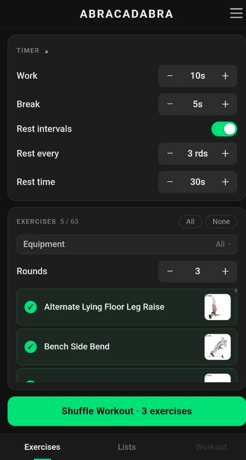
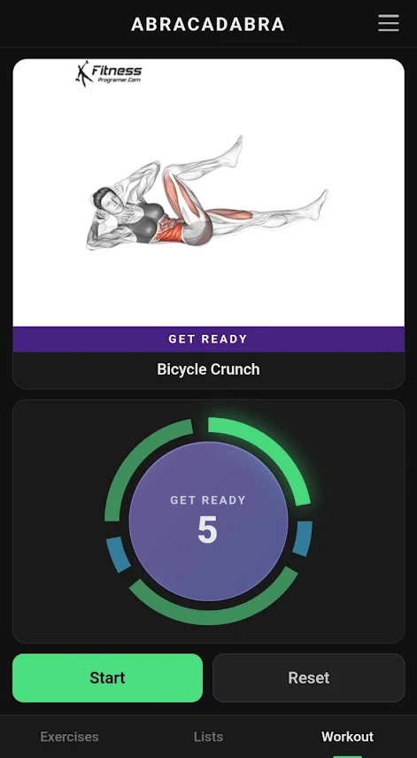

# Abracadabra

A mobile-friendly ab workout timer. Pick from a library of exercises (each with
a GIF demo), then either shuffle a random workout or build and save your own
workout lists. Runs the workout as a configurable interval timer with voice
cues, rest breaks, and a progress dial.

**Live app:** https://vadimengine.github.io/abracadabra/

<p>
  
  
</p>

## Development

```
npm install
npm start
```

## Exercise GIFs

Exercise animations sourced from:

- https://loadmuscle.com/exercises
- https://fitnessprogramer.com/exercise-primary-muscle/abs/
